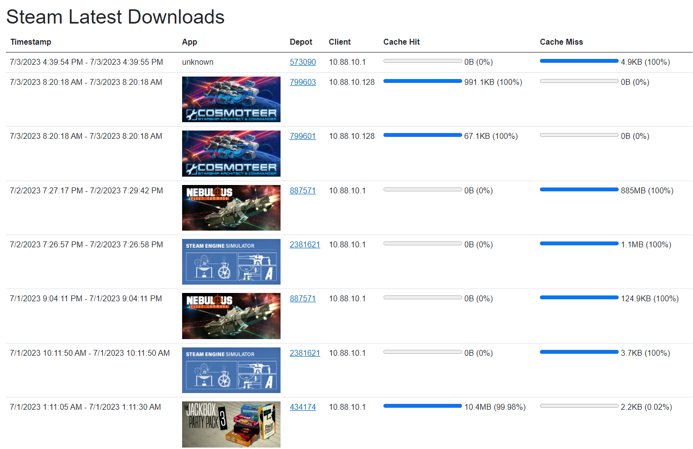

# DeveLanCacheUI_Frontend
A UI for Lan Cache. I'm tracking progress mostly in the Backend repository:
https://github.com/devedse/DeveLanCacheUI_Backend/

## Related projects

| Project | Explanation |
| -- | -- |
| [DeveLanCacheUI_Backend](https://github.com/devedse/DeveLanCacheUI_Backend/) | The main project. Contains the readme. |
| [DeveLanCacheUI_Frontend](https://github.com/devedse/DeveLanCacheUI_Frontend/) | The Frontend. |
| [DeveLanCacheUI_SteamDepotFinder](https://github.com/devedse/DeveLanCacheUI_SteamDepotFinder) | A tool to generate the mapping for steam depots and games. Kinda deprecated when `Feature_DirectSteamIntegration` is set to true |
| [DeveLanCacheUI_SteamDepotFinder_Runner](https://github.com/devedse/DeveLanCacheUI_SteamDepotFinder_Runner) | Runs the SteamDepotFinder on a weekly basis. |

## How to run this
See: https://github.com/devedse/DeveLanCacheUI_Backend/

## Build status

| GitHubActions Builds |
|:--------------------:|
|  |

## DockerHub

| Docker Hub |
|:----------:|
|  |

## Code Coverage Status

| CodeCov |
|:-------:|
|  |

## Code Quality Status

| SonarQube |
|:---------:|
|  |
